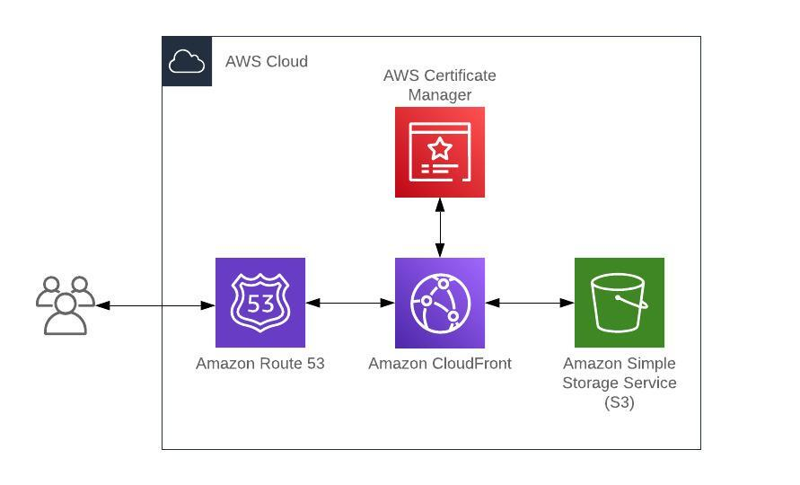

# CloudFront S3 Static Website with Custom Domain

## Table of Contents

- [Overview](#overview)
- [Architecture](#architecture)
- [Prerequisites](#prerequisites)
- [Deployment Guide](#deployment-guide)
- [Template Parameters](#template-parameters)
- [Stack Outputs](#stack-outputs)
- [Security Features](#security-features)
- [Maintenance](#maintenance)
- [Cleanup](#cleanup)

## Overview

This repository contains AWS CloudFormation templates to deploy a static website using S3 and CloudFront with a custom domain name and HTTPS support.

## Architecture



## Prerequisites

Before deploying this template, you need:

1. An AWS Account
2. AWS CLI installed and configured
3. A domain registered in Route 53
4. An ACM certificate for your domain (must be in us-east-1 region)

## Step-by-Step Deployment Guide

### 1. Prepare SSL Certificate

1. Go to AWS Certificate Manager (ACM) in the `us-east-1` region
2. Click "Request a certificate"
3. Select "Request a public certificate"
4. Enter your domain name (e.g., `www.example.com`)
   - Optionally add additional domains (e.g., `example.com`)
5. Choose "DNS validation"
6. Create the certificate and follow the validation process
7. Save the ACM certificate ARN for later use

### 2. Get Route 53 Hosted Zone ID

1. Go to Route 53 in AWS Console
2. Click on "Hosted zones"
3. Select your domain
4. Copy the Hosted Zone ID (It looks like "Z0XXXXXXXXXXXXX")

### 3. Deploy the CloudFormation Stack

1. Clone this repository:

```bash
git clone [repository-url]
cd [repository-name]
```

2. Deploy the stack using AWS CLI:

```bash
aws cloudformation create-stack \
  --stack-name my-static-website \
  --template-body file://template.yaml \
  --parameters \
    ParameterKey=DomainName,ParameterValue=www.example.com \
    ParameterKey=HostedZoneId,ParameterValue=YOUR_HOSTED_ZONE_ID \
    ParameterKey=AcmCertificateArn,ParameterValue=YOUR_ACM_CERT_ARN
```

Replace:

- `www.example.com` with your domain
- `YOUR_HOSTED_ZONE_ID` with your Route 53 Hosted Zone ID
- `YOUR_ACM_CERT_ARN` with your ACM Certificate ARN

### 4. Upload Website Content

1. Wait for the stack creation to complete
2. Get the S3 bucket name from stack outputs:

```bash
aws cloudformation describe-stacks \
  --stack-name my-static-website \
  --query 'Stacks[0].Outputs[?OutputKey==`S3BucketName`].OutputValue' \
  --output text
```

3. Upload your website content:

```bash
aws s3 sync ./website-content s3://YOUR_BUCKET_NAME
```

### 5. Verify Deployment

1. Wait for CloudFront distribution deployment (can take up to 15 minutes)
2. Visit your domain name in a web browser
3. Verify that:
   - HTTPS is working
   - Custom domain is accessible
   - Content is being served correctly

## Template Parameters

### Required Parameters

- **DomainName**

  - Description: Your custom domain name for the CloudFront distribution
  - Type: String
  - Example: `www.example.com`
  - Requirements:
    - Must be a valid domain name
    - Must match the domain in your ACM certificate
    - Cannot be already in use by another CloudFront distribution

- **HostedZoneId**

  - Description: The Route 53 Hosted Zone ID where your domain is managed
  - Type: String
  - Example: `Z0XXXXXXXXXXXXX`
  - Requirements:
    - Must be a valid Route 53 Hosted Zone ID
    - Must correspond to the domain specified in DomainName
    - Can be found in the Route 53 console

- **AcmCertificateArn**
  - Description: The ARN of your ACM certificate
  - Type: String
  - Example: `arn:aws:acm:us-east-1:123456789012:certificate/xxxxx-xxxxx`
  - Requirements:
    - Must be in the us-east-1 region
    - Must be validated and in "Issued" state
    - Must cover the specified DomainName
    - Format: `arn:aws:acm:us-east-1:ACCOUNT_ID:certificate/CERTIFICATE_ID`

### How to Find Parameter Values

- **For DomainName:**

  - Use your registered domain or subdomain
  - Ensure it matches your SSL certificate

- **For HostedZoneId:**
  ```bash
  aws route53 list-hosted-zones \
    --query 'HostedZones[].{Id:Id,Name:Name}'
  ```

## Security Features

- Private S3 bucket accessible only through CloudFront
- Automatic HTTPS redirection
- TLS 1.2 minimum protocol version
- Origin Access Identity for secure S3 access

## Maintenance

### Updating Website Content

To update your website content:

```bash
aws s3 sync ./website-content s3://YOUR_BUCKET_NAME
```

### Invalidating CloudFront Cache

To invalidate the CloudFront cache after content updates:

```bash
aws cloudfront create-invalidation \
  --distribution-id YOUR_DISTRIBUTION_ID \
  --paths "/*"
```

## Cleanup

To delete the stack and all associated resources:

```bash
aws cloudformation delete-stack --stack-name my-static-website
```

> **Warning:** This will delete all resources including the S3 bucket and its contents.
